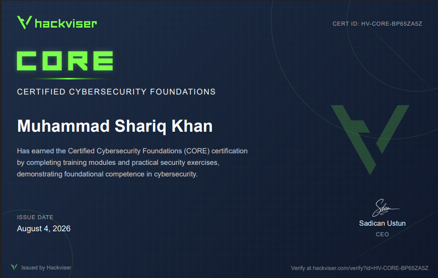
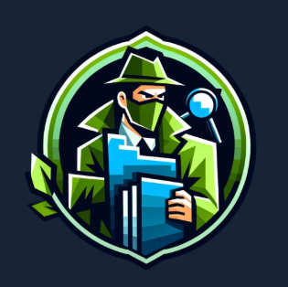
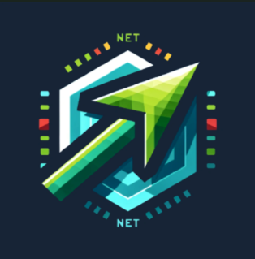
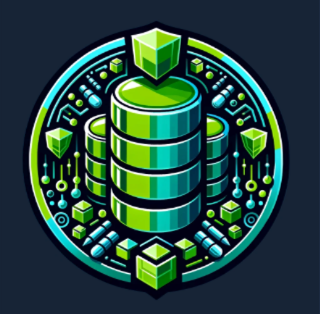

  

  
    &nbsp;
  
  &nbsp;
  
  &nbsp;
  

 

  

 

---

## 🔭 Currently Working On

| 🚧 Project | 💡 Focus Area | 🛠️ Stack |
|:---:|:---:|:---:|
| **SkyLens AI** | Tactical Android flight tracker with live aviation telemetry | `Kotlin` · `Jetpack Compose` · `MapLibre` · `OpenSky API` |
| **AttendAI** | AI-powered edge face recognition attendance platform | `FastAPI` · `React` · `DeepFace` · `MongoDB` |
| **PhishShield AI** | NLP-based phishing URL & SMS scam detection | `Python` · `Flask` · `Scikit-learn` · `TF-IDF` |

---

## 👨‍💻 About Me

   
  🎓 CS undergraduate at <strong>Namal University, Mianwali</strong>, graduating <strong>2027</strong>  
  💻 Building intelligent, scalable systems across <strong>Web</strong>, <strong>Android</strong>, and <strong>Desktop</strong>  
  🛡️ Engineering solutions in <strong>AI/ML</strong>, <strong>Mobile Dev</strong>, and <strong>Cybersecurity</strong>  
  🥇 <strong>1st Place</strong> | Competitive Programming, CodeX 3.0 (Namal University)  
  🥉 <strong>3rd Place</strong> | Vision Spark 2025, COMSATS Vehari  
  ☁️ <strong>AWS Campus Team</strong> | Technical Core Member  
  🎯 <strong>GDG Member</strong> &nbsp;|&nbsp; <strong>Aspire Leadership Program</strong> Alumni (Harvard-affiliated)  

---

## 🛠️ Unified Tech Stack Matrix

<table>
  <tr>
    <td valign="top" width="50%">
      
<strong>💻 Core Languages</strong>

       
      

        
      

    </td>
    <td valign="top" width="50%">
      
<strong>🌐 Systems &amp; Mobile Frameworks</strong>

       
      

        
      

    </td>
  </tr>
  <tr>
    <td valign="top" width="50%">
      
<strong>🗄️ Relational &amp; Document Stores</strong>

       
      

        
      

    </td>
    <td valign="top" width="50%">
      
<strong>⚙️ Infrastructure &amp; Engineering Tools</strong>

       
      

        
      

    </td>
  </tr>
</table>

---

## 🚀 Active Project Showcases

### 🔬 Artificial Intelligence &amp; Cyber Defense

<table border="0">
  <tr>
    <td width="50%" valign="top">
      

        <h3>🛡️ PhishShield AI</h3>
        
<em>AI-powered phishing URL &amp; SMS scam detector</em>

      

      <ul>
        <li>🔍 <strong>NLP Analysis:</strong> Extract character-level TF-IDF statistics.</li>
        <li>🧠 <strong>Classifiers:</strong> Multi-nomial Naive Bayes + Logistic Regression.</li>
        <li>⚡ <strong>Endpoints:</strong> Microservices via Flask REST APIs.</li>
      </ul>
      

        
        
        
        
          
        
      

    </td>
    <td width="50%" valign="top">
      

        <h3>🎓 AttendAI</h3>
        
<em>Edge face recognition attendance system</em>

      

      <ul>
        <li>👁️ <strong>Biometrics:</strong> DeepFace FaceNet512 embeddings pipeline.</li>
        <li>🎛️ <strong>Engine:</strong> Real-time OpenCV video stream parsing + SVM classification.</li>
        <li>📡 <strong>Stack:</strong> React UI dashboard linked to FastAPI endpoints.</li>
      </ul>
      

        
        
        
        
          
        
      

    </td>
  </tr>
</table>

### 📱 Android, AR &amp; Game Engines

<table border="0">
  <tr>
    <td width="33%" valign="top">
      

        <h4>✈️ SkyLens AI</h4>
        
<em>Tactical flight tracker</em>

      

      <ul>
        <li>🗺️ Live OpenSky telemetry maps</li>
        <li>🏗️ Jetpack Compose + MVVM</li>
        <li>📱 MapLibre Engine Integration</li>
      </ul>
      

        
        
      

    </td>
    <td width="33%" valign="top">
      

        <h4>📡 SignalLens AR</h4>
        
<em>Spatial network visualizer</em>

      

      <ul>
        <li>🔭 Real camera HUD overlays</li>
        <li>📶 Real-time WiFi/RF mapping</li>
        <li>🏗️ Kotlin &amp; Android Studio</li>
      </ul>
      

        
        
          
        
      

    </td>
    <td width="33%" valign="top">
      

        <h4>🧱 Brick Breaker Reimagined</h4>
        
<em>Arcade legend, rebuilt</em>

      

      <ul>
        <li>🕹️ Modern gameplay mechanics</li>
        <li>✨ Customized Android engine</li>
        <li>🎨 Clean UI rendering</li>
      </ul>
      

        
        
          
        
      

    </td>
  </tr>
  <tr>
    <td width="33%" valign="top">
      

        <h4>🐦 FlappyCrow</h4>
        
<em>Android scroll game</em>

      

      <ul>
        <li>🎮 Dynamic obstacle collision</li>
        <li>🐦 Native Kotlin game states</li>
      </ul>
      

        
          
        
      

    </td>
    <td width="33%" valign="top">
      

        <h4>🔊 Aura</h4>
        
<em>AI text-to-speech engine</em>

      

      <ul>
        <li>🗣️ Local low-latency TTS</li>
        <li>🦋 Cross-platform Flutter client</li>
      </ul>
      

        
        
          
        
      

    </td>
    <td width="33%" valign="top">
      

        <h4>🌲 Forest Tic Tac Toe</h4>
        
<em>Themed mobile board</em>

      

      <ul>
        <li>🌿 Custom visual vector sets</li>
        <li>📱 Responsive game view grids</li>
      </ul>
      

        
        
      

    </td>
  </tr>
</table>

### ⚙️ Systems &amp; Compilation Labs

<table border="0">
  <tr>
    <td width="33%" valign="top">
      

        <h4>🔤 NovaLang</h4>
        
<em>Compiler &amp; Grammar Engine</em>

      

      <ul>
        <li>⚙️ Custom parser and interpreter</li>
        <li>🖥️ Next.js interactive sandbox IDE</li>
      </ul>
      

        
        
      

    </td>
    <td width="33%" valign="top">
      

        <h4>🖥️ RISC-V Single Cycle CPU</h4>
        
<em>Hardware Processor Model</em>

      

      <ul>
        <li>⚡ Full instruction line execution</li>
        <li>🔩 Verilog control units &amp; ALUs</li>
      </ul>
      

        
        
      

    </td>
    <td width="33%" valign="top">
      

        <h4>📲 GetIt</h4>
        
<em>Android File Downloader</em>

      

      <ul>
        <li>💾 Storage API media query files</li>
        <li>🦋 Built with Flutter &amp; Dart</li>
      </ul>
      

        
        
          
        
      

    </td>
  </tr>
</table>

---

## 🏆 Verified Credentials &amp; Badges

### 🥇 Academic Awards &amp; Competitions
- 🥇 **1st Position** | Competitive Programming, CodeX 3.0 (Namal University)
- 🥉 **3rd Position** | On-Spot Programming Competition, Vision Spark 2025 (COMSATS Vehari)
- 🏅 **5th Position** | Cybersecurity &amp; Capture The Flag (CTF) Workshop
- 🎓 **Alumni** | Aspire Leadership Program (Harvard-affiliated initiative)
- ☁️ **Technical Core Member** | AWS Campus Team, Namal University

### 🏅 Google Developer Badges

&nbsp;

&nbsp;

&nbsp;

&nbsp;

&nbsp;

&nbsp;

&nbsp;

*Click any badge to verify credentials on my [Google Developer Profile](https://developers.google.com/profile/u/106979308278031459499)*

### 🏅 Hackviser Credentials

  
  &nbsp;
      
  

  
  &nbsp;
  
  &nbsp;
  

### 🔒 Ciscs Credentials

  

---

## 📈 Activity &amp; Telemetry Analytics

  <table border="0">
    <tr>
      <td width="50%" align="center">
        
      </td>
      <td width="50%" align="center">
        
      </td>
    </tr>
  </table>

   

  

 

  

---

## 💼 Experience Log &amp; Leadership
- 📸 **Media Head** | Scholar Bridge Society (SBS), Namal University *(2024 - 2025)*
- 🎯 **Event Management Head** | Namal Idea Club (NIC) *(Sep 2025 - 2026)*
- 💡 **Event Management Head** | Namal Computing Society (NCS) *(Sep 2025 - 2026)*
- 🏫 **Work-Study Student** | Namal University *(Sep 2024 - Aug 2025)*

---

  

 

  <h3>⚡ "Translating complexity into scalable, executable solutions."</h3>
   

  
  &nbsp;&nbsp;&nbsp;&nbsp;
  
  &nbsp;&nbsp;&nbsp;&nbsp;
  
  &nbsp;&nbsp;&nbsp;&nbsp;
  

 

  

